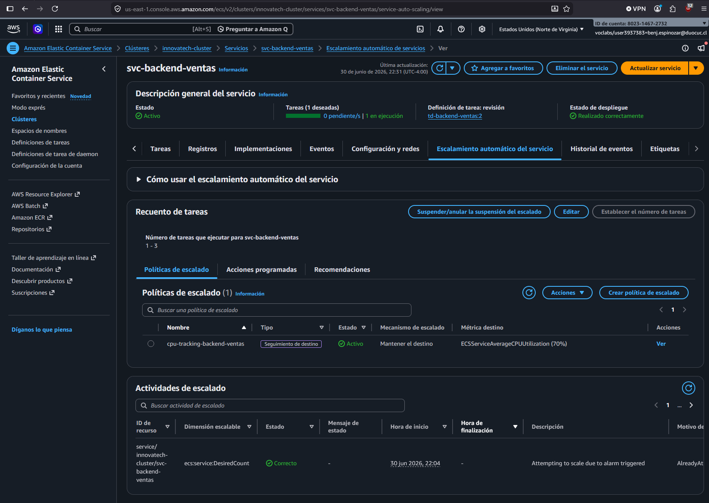
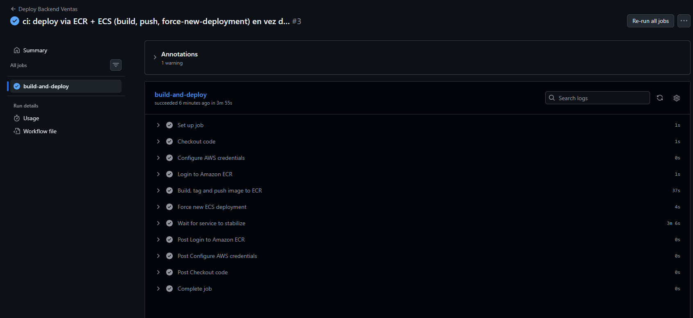
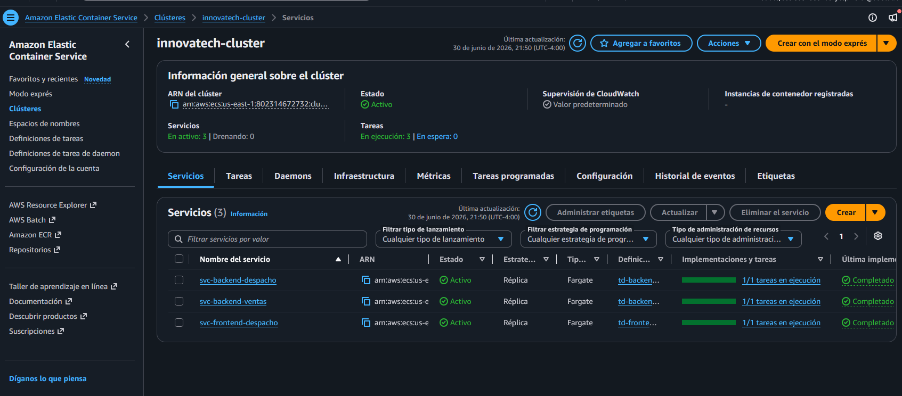

# Backend Ventas — Innovatech Chile

API REST desarrollada con **Spring Boot y Java 17** para la gestión de ventas de Innovatech Chile. Expone los endpoints necesarios para consultar, registrar y administrar las ventas de la empresa.

Este repositorio es una de las 3 piezas del sistema desplegado en un mismo clúster **AWS ECS Fargate** (junto a [`frontend-despacho`](https://github.com/Benjamin-0101/frontend-despacho) y [`backend-despacho`](https://github.com/Benjamin-0101/backend-despacho)). Este README documenta el rol de este servicio en esa arquitectura y cubre los indicadores de evaluación IE1–IE7 del laboratorio EP3.

---

## Tecnologías

- Java 17
- Spring Boot 3.4.4
- Maven
- MySQL 8.0
- Docker

---

## Arquitectura del clúster (IE1)

```
Internet
   │ HTTP :80
   ▼
Application Load Balancer (alb-innovatech)
  Listener :80 — 3 reglas path-based:
    Prioridad  1: /api/v1/ventas* → tg-backend-ventas   ◄── este servicio
    Prioridad 10: /api/*          → tg-backend-despacho
    Default:      /*              → tg-frontend
  SG: alb-despacho-ep3 (80/443 desde 0.0.0.0/0)
   │
   ▼ :8080
┌───────────────────────────────┐
│ ECS Fargate — svc-backend-     │
│ ventas                         │
│                                 │
│  ┌───────────────────────────┐ │
│  │ Spring Boot API :8080      │ │
│  └──────────────┬─────────────┘ │
│                 │ localhost:3306 │
│  ┌──────────────▼─────────────┐ │
│  │ MySQL 8.0 (sidecar)        │ │
│  └───────────────────────────┘ │
│                                 │
│ 1024 CPU / 2048 MB (task total)│
│ SG: backend-ecs-ep3             │
└───────────────────────────────┘

VPC: vpc-0a3f321f3d87759a7 (172.31.0.0/16) — subnets públicas us-east-1a/1b/1c
Clúster: innovatech-cluster (ECS Fargate, launch-type FARGATE directo —
  el Learner Lab no pre-crea el service-linked role AWSServiceRoleForECS,
  por lo que el clúster se creó sin especificar capacity providers)
ECR: 802314672732.dkr.ecr.us-east-1.amazonaws.com/innovatech-backend-ventas
IAM: execution role y task role = LabRole (rol único provisto por AWS Academy
  Learner Lab; en producción se usarían dos roles separados con privilegio
  mínimo — no fue posible crear roles IAM propios por restricción del Lab)
```

**Nota sobre la prioridad de las reglas del ALB:** `/api/v1/ventas*` tiene prioridad **1** (más alta) y `/api/*` tiene prioridad **10**. Esto es intencional: si `/api/*` tuviera mayor prioridad, capturaría también las rutas de ventas antes de que la regla específica pudiera evaluarse, enviando tráfico de ventas al backend de despacho por error.

**Este servicio (`svc-backend-ventas`) en el clúster:**

| Recurso | Valor |
|---|---|
| Task Definition | `td-backend-ventas` (revisión activa `:2`) |
| CPU / Memoria (task) | 1024 / 2048, compartido entre 2 contenedores |
| Contenedores | `backend-ventas` (Spring Boot :8080) + `mysql-ventas` (sidecar, `localhost:3306`) |
| ECR repo | `innovatech-backend-ventas` |
| Security Group | `backend-ecs-ep3` (`sg-03694ff1ad3cca3e9`) — solo acepta tráfico desde el SG del ALB, puerto 8080 |
| Target Group | `tg-backend-ventas`, puerto 8080, health check `/api/v1/ventas` |
| Autoscaling | ver sección IE3 |

**Por qué `assignPublicIp: ENABLED` sin exponer el servicio:** la VPC default no tiene subnets privadas ni NAT Gateway, y Fargate necesita salida a internet para hacer `docker pull` desde ECR. La tarea tiene IP pública, pero el aislamiento real lo garantiza el Security Group `backend-ecs-ep3`: ningún puerto está abierto desde `0.0.0.0/0`, solo desde el SG del ALB. Validado en IE7.

**Por qué sidecar MySQL y no RDS:** restricción de presupuesto del Learner Lab. El sidecar reutiliza el presupuesto de la task ya asignada. **Limitación conocida y deliberada:** los datos son efímeros — se pierden si ECS reemplaza la task (scale-in, redeploy, fallo). En producción se usaría RDS Multi-AZ.

---

## Requisitos previos

- [Docker](https://www.docker.com/) y Docker Compose instalados

---

## Variables de entorno

Copia el archivo `.env.example` como `.env` en la raíz del proyecto y completa los valores:

```bash
cp .env.example .env
```

| Variable | Descripción |
|---|---|
| `MYSQL_ROOT_PASSWORD` | Contraseña del usuario root de MySQL |
| `MYSQL_DATABASE` | Nombre de la base de datos creada al iniciar el contenedor |
| `MYSQL_USER` | Usuario de MySQL para la aplicación |
| `MYSQL_PASSWORD` | Contraseña del usuario de MySQL |
| `DB_NAME` | Nombre de la base de datos usada por Spring Boot |
| `DB_USERNAME` | Usuario que Spring Boot usa para conectarse |
| `DB_PASSWORD` | Contraseña que Spring Boot usa para conectarse |

En producción (ECS) estos valores no se pasan en texto plano: los de contraseña vienen de **SSM Parameter Store** (ver IE5) y `DB_ENDPOINT`/`DB_PORT` apuntan a `localhost:3306` (el sidecar, en la misma task).

---

## Correr localmente

```bash
docker-compose up --build
```

La API estará disponible en [http://localhost:8080](http://localhost:8080).

> El servicio `backend` espera a que el contenedor `db` esté saludable antes de iniciar (healthcheck con `mysqladmin ping`).

---

## Estructura Docker

El proyecto usa un **Dockerfile multi-stage**:

- **Stage 1** — `maven:3.9-eclipse-temurin-17` compila el proyecto con `mvn package -DskipTests`
- **Stage 2** — `eclipse-temurin:17-jre-alpine` ejecuta el jar generado con un usuario sin privilegios (`appuser`)

---

## Despliegue en el clúster (IE2)

```
CI/CD push imagen a ECR (innovatech-backend-ventas:latest)
        │
        ▼
ECS Fargate lanza tarea nueva de svc-backend-ventas
  (2 contenedores: mysql-ventas arranca primero, backend-ventas se conecta
   a localhost:3306; 1024 CPU / 2048 MB compartidos)
        │
        ▼
Tarea pasa el health check HTTP GET /api/v1/ventas en el puerto 8080
        │
        ▼
ALB registra la tarea en tg-backend-ventas (regla de prioridad 1: /api/v1/ventas*)
```

- **Puerto expuesto:** 8080 (HTTP, Spring Boot). No accesible desde internet — solo desde el ALB (ver IE1 y IE7).
- **Variables de entorno reales inyectadas por la Task Definition:** `DB_ENDPOINT=localhost`, `DB_PORT=3306`, `DB_NAME`, `DB_USERNAME` en claro (no sensible) + `DB_PASSWORD`/`MYSQL_ROOT_PASSWORD` desde SSM (ver IE5).
- **Balanceador operativo:** confirmado — ver IE7.

---

## Configuración de Autoscaling (IE3)

| Servicio | Métrica | Umbral | Min | Max | Scale-Out | Scale-In |
|---|---|---|---|---|---|---|
| `svc-backend-ventas` | CPU promedio (Target Tracking) | **70%** | 1 | 3 | 60 s | 120 s |

**Justificación del umbral de 70% CPU:**

1. **Margen para el cold-start con sidecar MySQL:** una tarea nueva tarda 30-60 s en estar lista (init de MySQL + arranque de Spring Boot con Hibernate/JPA — en la práctica, ~20-22 s solo el Spring context, ver IE6). Escalar en 70% (no 90%) da margen para que la tarea nueva esté lista antes de que la existente se sature.
2. **Balance costo/disponibilidad académico:** un umbral de 50% triplicaría el costo Fargate ante carga moderada normal, sin necesidad real en un entorno de laboratorio.
3. **Cooldowns asimétricos (60 s scale-out / 120 s scale-in):** reacción rápida ante picos; conservador al bajar, para no desactivar una tarea que recién terminó su costoso cold-start con sidecar.

En producción se añadiría tracking de memoria al 75% adicional al de CPU, ya que el sidecar MySQL consume RAM predecible independiente de la carga de CPU del API — no implementado aquí por estar fuera del alcance del lab.



*Política `cpu-tracking-backend-ventas` (Target Tracking, 70% CPU) activa en la consola ECS — pestaña "Auto Scaling" del servicio `svc-backend-ventas`.*

---

## Pipeline CI/CD (IE4)

Definido en [`.github/workflows/deploy.yml`](.github/workflows/deploy.yml), se dispara automáticamente en cada `push` a la rama `deploy`.

```
push a rama "deploy"
   │
   ▼
Checkout del código
   │
   ▼
configure-aws-credentials (Secrets: AWS_ACCESS_KEY_ID / AWS_SECRET_ACCESS_KEY / AWS_SESSION_TOKEN)
   │
   ▼
Login a ECR (aws-actions/amazon-ecr-login)
   │
   ▼
docker build → tag :${{ github.sha }} y :latest
   │
   ▼
docker push (ambos tags)
   │
   ▼
aws ecs update-service --force-new-deployment
   │
   ▼
aws ecs wait services-stable   (falla activamente si el servicio no
                                 alcanza runningCount = desiredCount)
```

**Por qué es seguro:**
- Credenciales AWS solo como GitHub Secrets cifrados, nunca en código.
- Credenciales **temporales** (AWS Academy Learner Lab), no un usuario IAM permanente.
- Sin OIDC (no soportado por el Lab) — mitigado con expiración corta de sesión.
- Imagen etiquetada con el SHA del commit además de `latest` → trazabilidad exacta.

**Por qué es funcional, con evidencia real de un fallo real:** el `deploy exitoso` no se asumió por el pipeline en verde — se verificó directamente con `aws ecs describe-services`. Este servicio, igual que `backend-despacho`, pasó su primer pipeline en verde pero quedó en crash-loop real (ver IE6): la verificación de "deploy exitoso" tuvo que llegar hasta el estado real del servicio corriendo en ECS, no solo hasta el resultado del workflow.



*Ejecución real del pipeline (run #3, `28486286712`, 3m55s) con todos los steps expandidos. Nota: este run corresponde al primer push de prueba — el pipeline pasó en verde, pero el servicio quedó en crash-loop hasta aplicar el fix de JDBC documentado en la sección IE6.*

---

## Gestión de Secrets y credenciales (IE5)

| Secret | Dónde vive | Uso | Notas de seguridad |
|---|---|---|---|
| `AWS_ACCESS_KEY_ID` / `AWS_SECRET_ACCESS_KEY` / `AWS_SESSION_TOKEN` | GitHub Secrets | Autenticación del pipeline CI/CD | Temporales (Learner Lab), cifrados por GitHub, nunca en el repo |
| `ep3-ventas-DB-PASSWORD` | SSM Parameter Store (SecureString, KMS) | Password de `ventas_user` | Inyectado por ECS como variable de entorno al arrancar el contenedor — nunca queda en la Task Definition en texto plano |
| `ep3-ventas-MYSQL-ROOT-PASSWORD` | SSM Parameter Store (SecureString, KMS) | Password root del sidecar MySQL | Idem |

**Decisiones de seguridad:**
- **SSM SecureString en vez de `environment` plano en la Task Definition:** si los passwords estuvieran en `environment`, aparecerían en claro en la consola de ECS y en los logs de despliegue. SSM los cifra con KMS y ECS los desencripta solo al inyectarlos en el contenedor.
- **Usuario de BD dedicado (`ventas_user`), no compartido con `backend-despacho`:** principio de mínimo privilegio — si este servicio se ve comprometido, el atacante no obtiene acceso a la base de datos de despachos.
- **Nombres de parámetro SSM planos** (`ep3-ventas-DB-PASSWORD`, sin `/` inicial): el Learner Lab bloquea jerarquía SSM (`ValidationException` con nombres tipo `/ep3/ventas/...`); se adaptó el naming sin afectar el cifrado ni el control de acceso.
- Los passwords se generaron con `openssl rand -base64 24` directamente en el shell — nunca se escribieron en archivos ni quedaron visibles en el historial de esta conversación.

Sin secrets hardcodeados en el repositorio, `Dockerfile` ni historial de commits — confirmado por inspección manual antes de cada commit de esta fase.

---

## Análisis de logs, métricas y tiempos del pipeline (IE6)

### Tiempos reales del pipeline (Actions, `deploy` branch)

| Run | Resultado | Duración | Nota |
|---|---|---|---|
| [`28486286712`](https://github.com/Benjamin-0101/backend-ventas/actions/runs/28486286712) — push de prueba (2026-07-01) | ✅ pipeline success | 3m55s | Servicio quedó en **crash-loop** pese al pipeline verde (ver hallazgo abajo) |
| [`28487741997`](https://github.com/Benjamin-0101/backend-ventas/actions/runs/28487741997) — push del fix | ✅ success | **4m21s** | Servicio confirmado estable, `runningCount=desiredCount=1` |

A diferencia de `backend-despacho`, este pipeline no tuvo que reintentarse por expiración de credenciales — las credenciales del Learner Lab se renovaron entre ambos despliegues.

### Hallazgo real: crash-loop por autenticación MySQL 8 (mismo bug que backend-despacho, diagnosticado de forma independiente)

Tras el primer push exitoso, la consola ECS mostraba `runningCount=0` (desired=1) en ciclo continuo `started → registered → draining`. Diagnóstico verificado directo desde CloudWatch y `aws ecs describe-tasks`:

```
java.sql.SQLNonTransientConnectionException: Public Key Retrieval is not allowed
Caused by: com.mysql.cj.exceptions.UnableToConnectException: Public Key Retrieval is not allowed
```

- `stoppedReason`: `"Essential container in task exited"`, contenedor `backend-ventas` con `exitCode: 1`; el sidecar `mysql-ventas` salía con `exitCode: 0` (arrancaba bien).
- **Causa raíz:** MySQL 8 usa por defecto el plugin de autenticación `caching_sha2_password`, que requiere intercambiar la clave pública RSA del servidor si la conexión no usa SSL. El driver `mysql-connector-j` 9.1.0 no tiene permiso de pedirla por defecto.
- **Fix:** agregar `allowPublicKeyRetrieval=true` a la URL JDBC en `application.properties` (`spring.datasource.url`).
- **Nota de proceso:** este mismo error se confirmó primero en `backend-despacho`; aquí se verificó de forma independiente contra los logs reales de `ecs-backend-ventas` (no se asumió que "el mismo fix" aplicaba sin comprobarlo) — resultó ser exactamente el mismo patrón, ya que ambos backends comparten la misma versión de MySQL, el mismo driver y la misma configuración de URL JDBC.

### Ejemplo real de logs (CloudWatch, log group `ecs-backend-ventas`) — tras el fix

```
2026-07-01T01:48:22.443Z  INFO 1 --- [Springboot-API-REST] [main] o.s.b.w.embedded.tomcat.TomcatWebServer  : Tomcat started on port 8080 (http) with context path '/'
2026-07-01T01:48:22.523Z  INFO 1 --- [Springboot-API-REST] [main] com.citt.SpringbootApiRestApplication    : Started SpringbootApiRestApplication in 20.371 seconds (process running for 22.864)
```

Arranque limpio, sin errores JDBC — Spring context completo en 20.371 s desde el inicio del proceso.

### Conclusión del análisis

El caso confirma el mismo patrón que en `backend-despacho`: "pipeline en verde" no equivale a "servicio corriendo". El workflow de CI/CD valida build + push + comando de despliegue aceptado, pero no valida la lógica de arranque interna del contenedor. La verificación real requirió `aws ecs describe-services` + `describe-tasks` + logs de CloudWatch, no solo el resultado de GitHub Actions. Como ambos backends comparten stack (Spring Boot + MySQL 8 + mismo driver JDBC), este bug era sistémico del stack, no un error aislado de un solo servicio — quedó documentado y corregido en los dos repos por igual.

Cómo consultar los logs en cualquier momento:

**Vía consola AWS:** `CloudWatch → Log groups → ecs-backend-ventas → (elegir el stream app/backend-ventas/<task-id> o mysql/mysql-ventas/<task-id> más reciente)`

**Vía AWS CLI:**
```bash
# Seguir todos los logs del servicio en vivo (ambos contenedores)
aws logs tail ecs-backend-ventas --follow --since 10m --region us-east-1

# Ver los últimos 60 minutos sin seguir en vivo
aws logs tail ecs-backend-ventas --since 60m --region us-east-1

# Filtrar solo el contenedor de la aplicación (excluye el sidecar MySQL)
aws logs tail ecs-backend-ventas --since 60m --region us-east-1 --log-stream-name-prefix "app/backend-ventas"
```

---

## Validación funcional del clúster — Frontend → Backend (IE7)

Validado end-to-end contra el DNS público del ALB (2026-07-01), tras resolver el crash-loop:



*Evidencia directa de IE1 (clúster funcional), IE2 (los 3 servicios desplegados correctamente) e IE7 (validación funcional): consola ECS mostrando `svc-frontend-despacho`, `svc-backend-despacho` y `svc-backend-ventas` con `runningCount = desiredCount = 1`, capturada después del fix del crash-loop JDBC.*

```bash
curl http://alb-innovatech-1857212096.us-east-1.elb.amazonaws.com/api/v1/ventas
# → 200 OK, JSON válido (arreglo vacío — sin datos de prueba cargados aún)
```


*Prueba de integración Frontend → Backend: la interfaz React consumiendo datos reales desde el backend de ventas a través del ALB, confirmando que el routing por path y la comunicación end-to-end funcionan.*

- **Comunicación Frontend → Backend confirmada:** el frontend (servido por `svc-frontend-despacho`) hace las llamadas `fetch`/`axios` directamente contra `http://alb-innovatech-.../api/v1/ventas` desde el navegador del usuario — el ALB enruta por la regla de **prioridad 1** (`/api/v1/ventas*`, evaluada antes que la regla genérica `/api/*` de despacho) hasta este servicio.
- **Aislamiento de red confirmado:** este backend tiene IP pública asignada (necesaria para el pull de ECR), pero el Security Group `backend-ecs-ep3` bloquea cualquier acceso directo desde `0.0.0.0/0` — solo el SG del ALB puede alcanzar el puerto 8080. Se puede reproducir:

```bash
TASK_ARN=$(aws ecs list-tasks --cluster innovatech-cluster \
  --service-name svc-backend-ventas --query "taskArns[0]" --output text --region us-east-1)
aws ecs describe-tasks --cluster innovatech-cluster --tasks $TASK_ARN --region us-east-1 \
  --query "tasks[0].attachments[0].details[?name=='networkInterfaceId'].value" --output text \
  | xargs -I{} aws ec2 describe-network-interfaces --network-interface-ids {} --region us-east-1 \
  --query "NetworkInterfaces[0].Association.PublicIp" --output text
# curl http://<esa-IP>:8080/api/v1/ventas  → timeout (SG bloquea; no responde)
```

- **Recuperación post-deploy demostrada — con un caso real, no solo teórico:** el propio incidente de esta fase (crash-loop → fix → redeploy → estabilización) es la evidencia de recuperación: tras corregir `application.properties` y hacer push, ECS reemplazó las tareas fallidas con la imagen corregida y el servicio pasó de `runningCount=0` a `runningCount=1` sin intervención manual sobre las tareas. También aplica el mecanismo estándar de rolling update en cada deploy:

```bash
aws ecs update-service --region us-east-1 \
  --cluster innovatech-cluster --service svc-backend-ventas --force-new-deployment

aws ecs describe-services --region us-east-1 \
  --cluster innovatech-cluster --services svc-backend-ventas \
  --query "services[0].{Running:runningCount,Pending:pendingCount,Deployments:deployments[*].{Status:status,Running:runningCount,Desired:desiredCount}}" \
  --output table
```

---

## Logs — CloudWatch

*(ver sección IE6 arriba — se mantiene aquí también por referencia rápida)*

---

## Infraestructura

La aplicación corre en **ECS Fargate** dentro del clúster `innovatech-cluster`, sin IP pública alcanzable directamente por el usuario final: todo el tráfico llega a través del ALB. El Security Group `backend-ecs-ep3` garantiza que solo el ALB pueda comunicarse con este servicio en el puerto 8080. No hay NAT Gateway ni subnets privadas en la VPC default del Lab — ver justificación de `assignPublicIp: ENABLED` en la sección de arquitectura (IE1).

---

**Cierre del proyecto:** 2026-07-01 — Encargo EP3-DevOps completo (Fases 1–8), evidencia de los indicadores IE1–IE7 documentada en este README.
